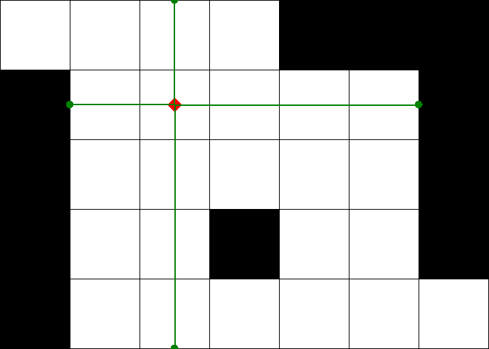

# Obstacle Detection

This python script takes robot position and input file with the description of the obstacles. As a result it produces `visualization.png` that displays the map and it prints to console the nearest obstacles to the robot from 4 directions.

## Running

### Without docker compose

The only library you might need to install is `Pillow`.

Command line arguments:

```
usage: locate_obstacles.py [-h] file_path robot_x robot_y

Draws the map using input file, robot position. Calculates closest obstacles
to the robot from each direction

positional arguments:
  file_path   Path to the file with the map
  robot_x     Coordinate x of the robot (float)
  robot_y     Coordinate y of the robot (float)

options:
  -h, --help  show this help message and exit
```

Example of usage:
```
$ python3 locate_obstacles.py sample_input/map.txt 2.5 1.5
```

### Using docker compose

The arguments are specified in Dockerfile. By default, sample map is used

```
$ docker-compose build
$ docker-compose up
$ docker-compose down
```

## Input

The input file format is:
```
widht height s
number_of_obstacles
description_of_obstacle_1
description_of_obstacle_2
description_of_obstacle_3
...
```
Each obstacle is a rectangle and should be described with the coordinates of left-up and right-down corners.

The example of input file can be found [here](./sample_input/map.txt).

## Output

The console output consists of the closests obstacles to the robot for 4 directions. Example:
```
0: (2.5, 0)
90: (6, 1.5)
180: (2.5, 5)
270: (1, 1.5)
```
In the `output/visualization.png` you can find the visualization of the map. Example: 